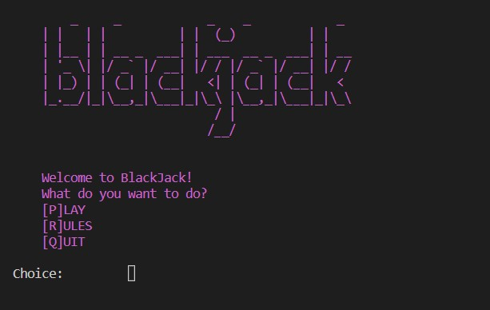
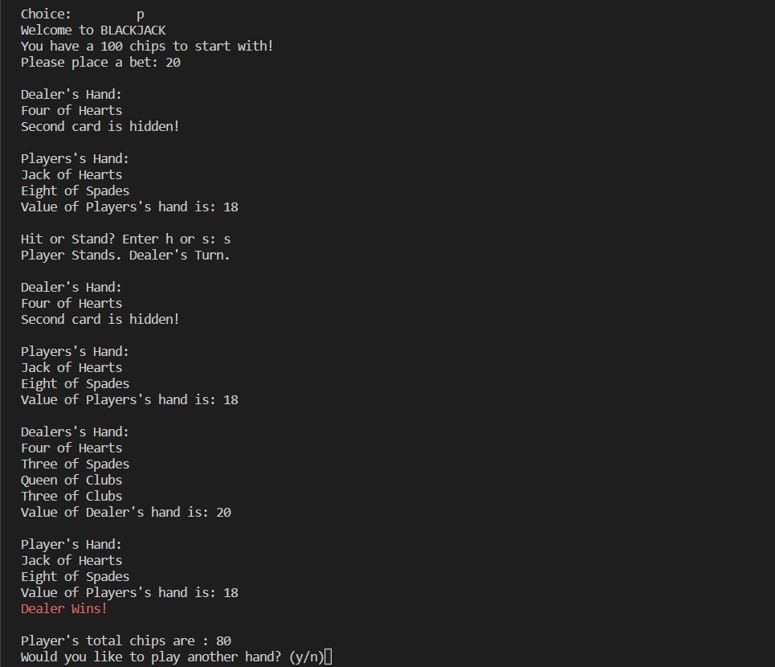
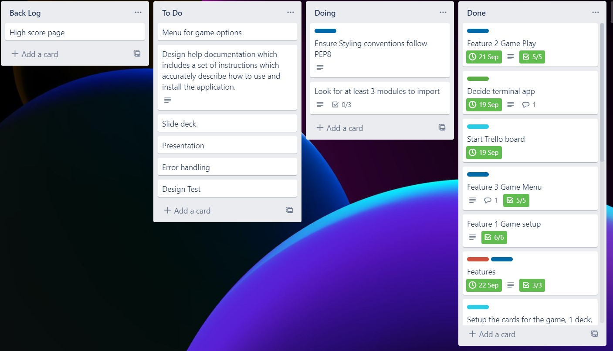

# T1A3- Kwong Gei Alvin Lai Terminal Application
[Git Repository](https://github.com/BigAlzzz/T1A3)

# **Welcome to my BlackJack terminal.**

## Purpose

The purpose of this application is to apply Python foundations learnt from Coders Academy to a terminal application.

## Features

1. Welcome page with menu
- From the welcome menu user user is prompt to make a selection with
- P or play, user will start the BlackJack application
- R or rules, user will be shown the rules of the game, user is able to go back out to the main menu.
- Q or Quit, user quits out of application and ends with a goodbye message.

2. The BlackJack application setup
- Game will have 52 cards with 4 suit generated
- The cards will then be randomised
- The player and dealer will be generated “hands”.
- Two cards will be dealt to “hands”.
- Dealer will display the value of a card and a hidden card
- Player will have both cards displayed

3. BlackJack Game play
- Game will prompt user to input a bet value
- Input has to be an integer, except is used to ERROR handle the ValueError, which will prompt the user to input an integer.
- Game will prompt user if user has insufficient chips to bet with.
- Player is able to input h(hit) or s(stand) to see if they beat the dealer.
- If input is the wrong value user will be prompt.
- Game will indicate if player has Won, Lost or draw(push)
- Colour is added to Winning or losing to bring out the user interface and user experience.
- Player can decide to continue playing if player has sufficient chip or end the game.

## Implementation Plan

The software Trello was used to develop an implementation plan.
The Trello board was split into 3 stages.
- To do list
- Doing list
- Done list
  
Below is an example of the process of an implementation plan from to do list to done.
- The to do list.
The to do list was where most of the brain storming happened. Initially two ideas came into mind, a Wordle app and a Blackjack app. The Blackjack app was selected as the logic of the app seemed simple at that time. The assessment rubric and requirements were used to setup the to do list. The application needed 3 features, initially only was could come into mind, the BlackJack game setup and the BlackJack game play. The third feature the game menu was only brought up later in the week after discussion with the educators.

The first feature, the game setup, with 5 or more items.
- The setup of the cards, there needed to be 52 cards with 4 suits.
- The deck needed to be randomised
- The dealer had a “hand” and the player had a “hand”
- The game starts with two cards being dealt to both “hands”.
- Dealer had 1 card revealed and 1 card hidden
- Player had both cards revealed.
- A reminder to make code DRY and to make use of loops, classes and functions.
Each one of these options then had their separate cards and were placed in the doing section.
- A tag was given to the card to indicate how difficult the task would be.
- Once completed card is moved into Done and the ticked off the checklist of the Feature.
- Date of completion is also selected
- The options also had a flow of pseudo code in mind
  
Doing list to Done list.
- On the day the feature is split into individual cards
- The cards are roughly given a pomodoro length to finish.
- If required more or less time is given.
- When a task is completed the individual card it marked off and placed in the Done section
- The checklist is ticked off in the main feature card.
- Once all the options are ticked off the card is moved into the done list.
- In the doing list a reminder of DRY and Pep8 styling remains constant until code was finished.

Below is a screen shot of the Trello boards and is also accessible here:[My Trello Board](https://trello.com/invite/b/ZjK88Iio/aa782f2ae21f87deb15df8ac5752752f/blackjack-terminal-app)

## Installation Instructions

1. Clone the files from this repostory using this command line:
   `git clone https://github.com/BigAlzzz/T1A3.git`
2. Execute this file through Visual studios:
   `python3 main.py`
3. Play the BlackJack

## Resources

- Styling of code and sturcture <https://peps.python.org/pep-0008/>